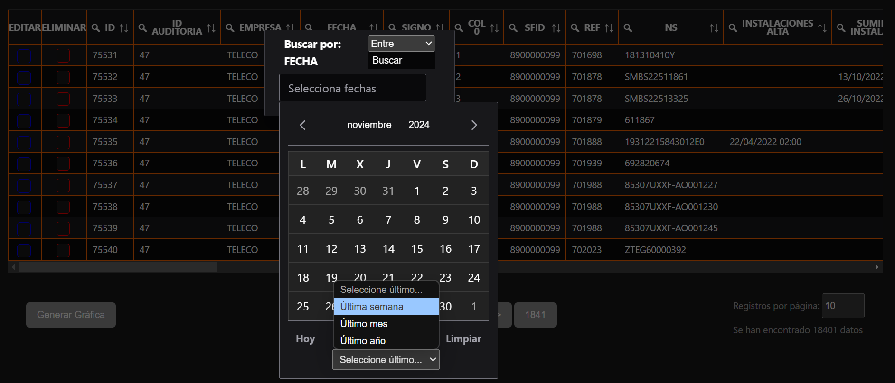

# Tabla_MuestraDatos

**Tabla dinámica de datos desarrollada durante mis prácticas en Applus para Orange**, enfocada en su **multi-funcionalidad** y **compatibilidad** con múltiples endpoints propios de la empresa.

Desarrollada utilizando:
- **Framework:** [Vue.js](https://vuejs.org/)
- **Bibliotecas:** [PrimeVue](https://primevue.org/) y [Chart.js](https://www.chartjs.org/)

---

## Funcionalidades

### 1. Paginación
- **Descripción:** Muestra los datos recibidos desde el endpoint con soporte para:
  - Parámetros de número de página y tamaño de la página.
  - Cálculo de la página máxima mediante una llamada de conteo de datos, útil al buscar múltiples registros.
  - Cálculo de posición de dato: si se disminuye el tamaño de la página, se calculará la página en la que aproximadamente se encontrará el dato que se estaba viendo (más precisión con los primeros datos de la página).
- **Ventaja:** Optimiza el rendimiento al gestionar grandes volúmenes de datos.


### 2. Búsqueda
- **Búsqueda dinámica:** Llamadas al endpoint según los parámetros seleccionados.
- **Opciones avanzadas:**
  - Búsqueda múltiple por diferentes columnas.
  - Búsqueda con calendario para columnas de tipo fecha:
    - `Antes de...`
    - `Después de...` (Con opción de elegir última semana/mes/año).
    - `Entre fechas`.




### 3. Generar Gráfica
- **Descripción:** Recuento de datos y generación de gráficos dinámicos mediante [Chart.js](https://www.chartjs.org/).
- **Tipos de gráficas:**
  1. **Gráfico de barras clásico:** Muestra el número de apariciones de una columna específica.
  2. **Gráfico de datos múltiples:** Relaciona valores de la columna seleccionada en "Contar por" con "Mostrar por".
- **Casos de uso:** Visualización rápida y análisis de patrones en los datos.


### 4. Ordenación de datos
- Iconos interactivos para ordenar los datos de cada columna:
  - **Ascendente**
  - **Descendente**
  - **Sin ordenación**
- **Ventaja:** Mejora la experiencia del usuario al trabajar con grandes conjuntos de datos.

### 5. Edición, visualización y eliminación de registros
- **Adaptabilidad:** Fácil integración en cualquier página.
- **Propósito:** Gestión eficiente de datos para edición, visualización o eliminación según las necesidades.


### 6. Visualización completa de datos y/o posible eliminación
- Al clicar tanto en el botón de eliminar como en una de las líneas, se mostrará un Dialog con 2 scrollers en los que se podrán ver los datos con sus nombres completos del registro. En la opción de eliminar, estarán los botones para confirmar y otra confirmación extra debido a que es una función que hay que manejar con cautela.
  - **Adaptabilidad:** La eliminación del dato tiene la llamada lista para poder adaptarse fácilmente a lo que se requiera.

### 7. Formato móvil
- Formato reactivo a las resoluciones de la pantalla y con los siguientes cambios en tamaño para dispositivos móviles:
  1. **Paginación:** 5 botones: primera página, anterior, página actual, siguiente página y última página.
  2. **Botones nuevos:** Necesidad de poner botones para buscar y para cambiar tamaño de página debido a la ausencia de la tecla "Enter" en el dispositivo móvil.

---

## Cómo usar

1. **Requisitos previos**: 
   - Node.js instalado.
   - Endpoint configurado para recibir los parámetros necesarios.

2. **Instalación**:
   ```bash
   npm install

   npm install
3. **Ejecución**
   ```bash
   npm run dev

### Contribución
Las contribuciones son bienvenidas. Por favor, abre un issue o envía un pull request si encuentras algo que pueda mejorarse.
